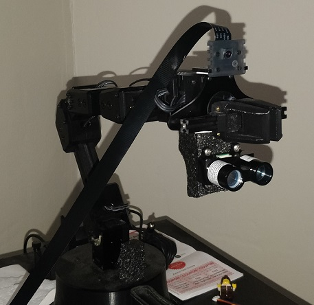

# ROS-Tests
These are my Robotic Operating System tests with the Trossen Robotics's ReactorX 150 Robot Arm

The whole system runs on the NVIDIA Jetson Nano Developer Kit.  After ROS is set up on the board,the Interbotix Robotic Arm ROS package needs to be set up on the system. That can be done from the [Interbotix GitHub](https://github.com/Interbotix/interbotix_ros_arms)

### ROS Test 1

First test was to test the Interbotix Python Examples and add some changes in order to get a custom output. The aim was to pick up an object from one point and place on the other point.

The second aim of the experiment was to move the robot to different positions using voice commands. This was done using one of the Python examples from the Interbotix Repository and adding the [Google Speech-To-Text API](https://pypi.org/project/google-cloud-speech/)

### ROS Test 2

Second test was meant to integrate the Interbotix Python SDK for a finer control on the robot using special keys on the keyboard. Every key was mapped to a particular joint movement and hitting the keys in succession added acceleration to the robot joint movement.

Python [pynput](https://pypi.org/project/pynput/) library was used for keyboard control. One shortcoming for this implementation is that other applications cannot be used using the keyboard while this script is running.

### ROS Test 3

Third test included adding a camera to the top of the arm, just before the gripper. The Jetson Nano ran a real-time object detection script on the stream being fed from the camera. The deep learning model used was from [Dustin Franklin](https://github.com/dusty-nv)'s [Jetson Inference](https://github.com/dusty-nv/jetson-inference) repository

### ROS Test 4

Fourth test was implementing LIDAR interfacing with the robot arm. The LIDAR sensor can be placed at the bottom of the arm's gripper. The test was run by connecting the following pins on the Jetson Nano GPIO pins

* Lidar VCC = GPIO 4
* Lidar GND = GPIO 6
* Lidar SDA = GPIO 27
* Lidar SCL = GPIO 28

The test code was cloned from the [Garmin Lidar Lite Repository](https://github.com/garmin/LIDARLite_RaspberryPi_Library)